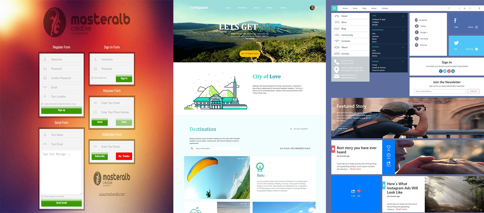
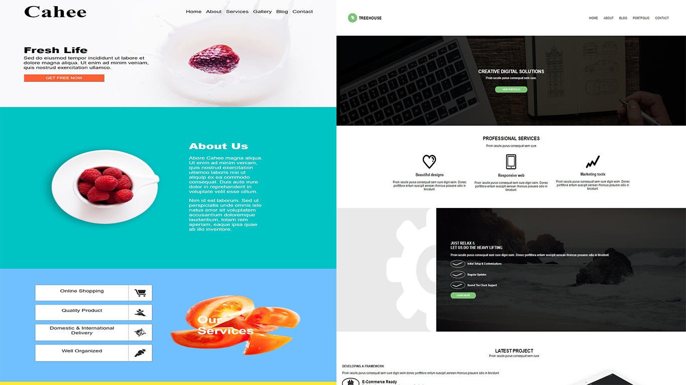

# Weekly WebDev Challenge - cookavsky
**_Folder for all Weekly WebDev Challenge. Challenge is PSD, which you must transform to the webpage._**

## Table of contents
* [Getting Started](#getting-started)
* [Screenshots](#screenshots)
* [Technologies](#technologies)
* [To do](#to-do)
* [Status](#status)
* [Source](#source)
* [Author](#author)

## Getting Started
It does not have any requirements. The principle of "copy, paste". I am trying to make a series of weekly challenges from facebook page: https://www.facebook.com/groups/940002776068923/ . The rules and method of doing it can be found on their facebook page.

## Screenshots

## Technologies
* HTML
* CSS
* JS
* PHP

# To do
- Create the rest

## Status
In progress.

## Source
[Folder WWC](https://drive.google.com/drive/folders/0Bw2hu70L5Ye_VkhvdDZhN3haSlE?fbclid=IwAR2x4UgF11_QnBQguVQCgdlFYgniZz5J46J2uX2aPhMpEwmgnRrGN0lbCzQ)

## Author
Created by **_cookavsky_** [WWC - 1](https://weeklyone.cookavsky.com/), [WWC - 2](https://weeklytwo.cookavsky.com/), [WWC - 3](https://weeklythree.cookavsky.com/), [WWC - 4](https://weeklyfour.cookavsky.com/), [WWC - 11](https://weeklyeleven.cookavsky.com/) - for friends Polska Panda.
